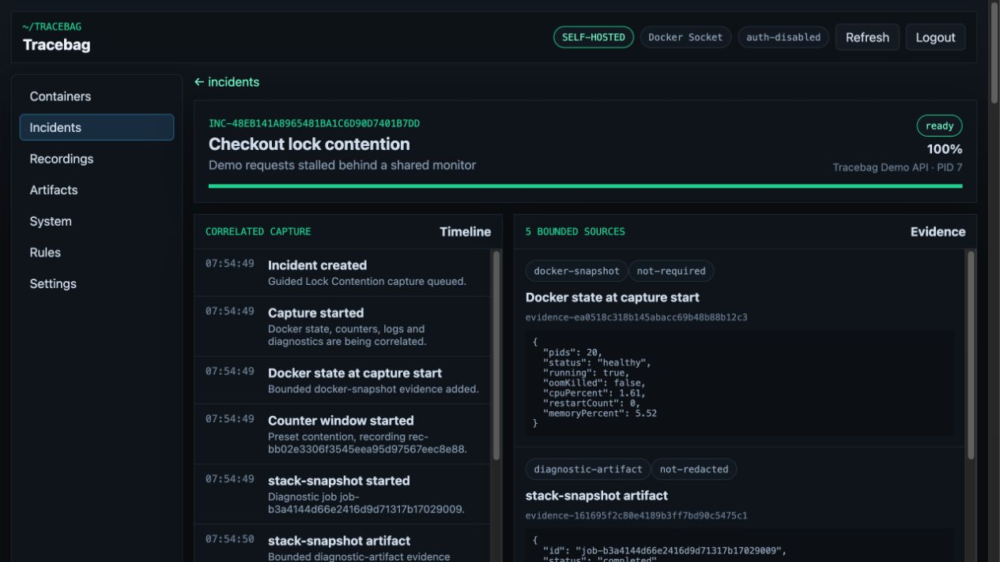
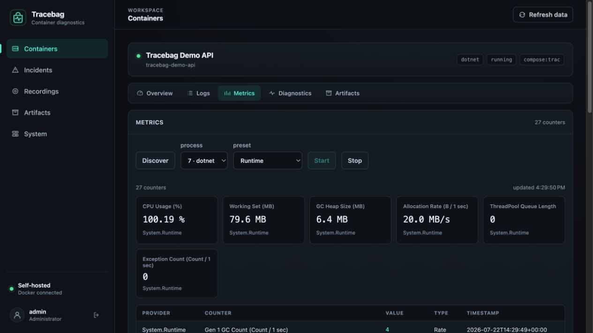

<p align="center">
  
</p>

<h1 align="center">Tracebag</h1>

Tracebag is an on-demand diagnostics UI for Dockerized .NET applications. Start
it on a Docker host for an investigation, use the browser to search logs, watch
runtime counters, capture stacks and traces, and keep the useful evidence in one
incident timeline. Stop it when the debugging session is complete.

Tracebag orchestrates Docker and the existing .NET diagnostic tools through
fixed, bounded operations. It does not expose a shell or accept arbitrary
Docker commands, and it ignores every container that has not explicitly opted
in.



## What it does

- **Find the relevant window.** Search retained container logs, follow a live
  tail, and line events up with Docker health and resource changes.
- **Measure runtime pressure.** Inspect live or recorded .NET counters for CPU,
  allocation, GC, ThreadPool, contention, and memory behavior.
- **Capture evidence before it disappears.** Take a bounded stack snapshot,
  EventPipe trace, GC dump, or explicitly gated process dump and keep the result
  with the incident that caused it.



Tracebag 0.1.2 supports Docker Engine on Linux `amd64` and `arm64`. Runtime
diagnostics use dedicated runners for .NET 8, 9, and 10. The web application,
API, and PostgreSQL database are installed together with Docker Compose.

## How a debugging session works

Prepare each target container once by adding explicit Tracebag labels and, for
.NET diagnostics, a named volume for the runtime diagnostic socket. The
Tracebag stack itself does not need to run until an investigation begins.

1. Start Tracebag with Docker Compose.
2. Open the UI locally or through the host's existing HTTPS reverse proxy.
3. Collect logs, counter recordings, stacks, traces, and other evidence.
4. Stop the stack. Its Docker access ends while named volumes preserve evidence
   for the next session.

The supplied Compose file does not restart Tracebag automatically. Continuous
collection is available through an explicit resident-mode override.

## Set up Tracebag

First setup creates a database secret and an administrator password hash. After
that, starting and stopping a session each takes one Compose command.

The [Docker installation guide](docs/quickstart.md) walks through the complete
sequence:

1. Download the Compose and environment files for an explicit version.
2. Generate the two required secrets.
3. Set an environment scope and, on a remote host, its HTTPS public URL.
4. Start Tracebag and verify its readiness endpoint.

The guide covers a same-host HTTPS reverse proxy, private-network restrictions,
optional SSH forwarding, persistent volumes, and continuous operation.

## Prepare a target container

Tracebag cannot see a workload until the workload opts in:

```yaml
services:
  api:
    environment:
      DOTNET_EnableDiagnostics: "1"
    volumes:
      - api-dotnet-tmp:/tmp
    labels:
      tracebag.enabled: "true"
      tracebag.environment: "production"
      tracebag.displayName: "My API"
      tracebag.logs.persist: "true"
      tracebag.logs.parser: "auto"
      tracebag.logs.retentionDays: "7"
      tracebag.kind: "dotnet"
      tracebag.dotnet.runtime: "8"
      tracebag.dotnet.tmpVolume: "my_api_dotnet_tmp"

volumes:
  api-dotnet-tmp:
    name: my_api_dotnet_tmp
```

The first label allows discovery and live logs; it does not retain logs for
search. The persistence label is a separate data-retention opt-in. The
environment label keeps unrelated projects on the same Docker host out of this
installation. The .NET labels and named `/tmp` volume enable process inspection
and profiling without putting diagnostic tools in the target image.

Docker labels and mounts cannot be added to an existing container. Prepare the
target before an incident; recreating it during an investigation can change the
failure state. See the [container label reference](docs/labels.md) for live-log
only and non-.NET configurations.

## What is available after startup

- Live logs are available for opted-in containers while Tracebag is running.
- Searchable logs require `tracebag.logs.persist=true`. On startup, Tracebag can
  ingest entries Docker still retains for the current container, but it cannot
  recover rotated or deleted logs.
- Counters, recordings, stack snapshots, traces, and Docker events are captured
  only while Tracebag is running.
- Run resident mode when complete continuous history is more important than
  limiting the time Docker access is active.

## Try it on the demo API

The repository includes a bounded .NET 8 workload that can generate CPU
pressure, allocations, lock contention, ThreadPool starvation, slow requests,
exceptions, and downstream failures without touching a real service.

```bash
./scripts/init-env.sh
./scripts/demo-up.sh --traffic
```

Open <http://localhost:9090>, then follow the
[ten-minute investigation](docs/demo-tour.md). Every synthetic workload has
server-owned duration and resource limits and can be reset.

## What Tracebag deliberately does not do

- It does not discover containers automatically; opt-in is required.
- It does not provide a browser shell or arbitrary Docker API access.
- It does not send captured evidence to a cloud analysis service.
- It does not hide the privilege of the Docker socket.
- It is not a Kubernetes or distributed tracing platform.

While Tracebag is running, its backend has Docker administrator capabilities.
The `:ro` socket mount does not make Docker API operations read-only. Run it
only on a host you control, keep authentication enabled, and use localhost or a
trusted HTTPS reverse proxy, optionally restricted to a private network or VPN.
Stopping the stack removes the running component with Docker access; retained
evidence remains sensitive.
Read the [security model](SECURITY.md) before putting it near production
workloads.

## Documentation

- [Install and operate Tracebag](docs/quickstart.md)
- [Run the demo investigation](docs/demo-tour.md)
- [Configure container labels](docs/labels.md)
- [Call the authenticated API](docs/api.md)
- [Understand diagnostics and artifacts](docs/diagnostic-jobs.md)
- [Upgrade, back up, and restore](docs/operations.md)
- [Review the architecture and trust boundaries](docs/architecture.md)

The full documentation index is available on the
[product website](https://poodlelab.github.io/tracebag/docs/).

## Development and contributions

Run the complete source, test, dependency, website, and repository checks with:

```bash
./scripts/verify.sh
```

See [CONTRIBUTING.md](CONTRIBUTING.md) for the development setup and pull-request
expectations. Support and security reports follow [SUPPORT.md](SUPPORT.md) and
[SECURITY.md](SECURITY.md).

Tracebag is developed with substantial AI assistance. Product direction,
architecture, review, verification, security decisions, and releases remain the
maintainer's responsibility. The disclosure and contribution rules are in
[AI_USAGE.md](AI_USAGE.md), and the instructions supplied to coding agents are
public in [AGENTS.md](AGENTS.md).

## License

Apache License 2.0. See [LICENSE](LICENSE).
